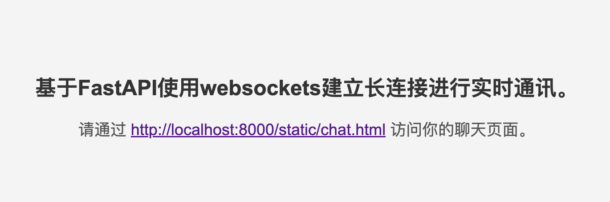

# WebSockets_with_FastAPI

基于FastAPI使用WebSockets建立长连接，实现客户端之间点对点的实时通讯。

- [WebSockets\_with\_FastAPI](#websockets_with_fastapi)
  - [前言:](#前言)
  - [项目概述:](#项目概述)
  - [应用场景:](#应用场景)
  - [项目运行:](#项目运行)
    - [1. 安装FastAPI:](#1-安装fastapi)
    - [2. 部署该 FastAPI 应用:](#2-部署该-fastapi-应用)
    - [3. 访问欢迎界面](#3-访问欢迎界面)
    - [4. 访问聊天界面:](#4-访问聊天界面)
    - [5. 打开多个界面，输入不同ID模拟多个用户进行测试:](#5-打开多个界面输入不同id模拟多个用户进行测试)
    - [6. 测试用户离开后效果:](#6-测试用户离开后效果)
  - [main.py主要模块和功能介绍(可选):](#mainpy主要模块和功能介绍可选)
    - [FastAPI 应用初始化:](#fastapi-应用初始化)
    - [ConnectionManager 类:](#connectionmanager-类)
    - [WebSocket 端点:](#websocket-端点)
    - [根路径处理:](#根路径处理)
  - [启动服务小技巧分享(可选):](#启动服务小技巧分享可选)
    - [使用默认端口(8000)启动服务:](#使用默认端口8000启动服务)
    - [使用自定义端口启动服务:](#使用自定义端口启动服务)
    - [动态调整端口号](#动态调整端口号)
  - [WebSocket连接时间解释(可选):](#websocket连接时间解释可选)
  - [left消息显示解惑(可选):](#left消息显示解惑可选)
  - [websockets支持的数据传输格式(可选):](#websockets支持的数据传输格式可选)


## 前言:

笔者使用FastAPI中静态文件加载的方式进行测试，大家可以根据个人习惯，将前端界面切换为自己喜欢的方式(Vue、React等)。


## 项目概述:

该项目主要功能是通过 WebSocket 实现多个客户端之间的实时聊天。客户端可以通过特定的 WebSocket 连接进行通信，并发送私密消息(点对点通信)给其他指定的客户端。


## 应用场景:

该项目适合用于需要实现实时通信功能的场景，例如：

- 在线客服系统
- 即时聊天应用
- 协作工具中的实时交流模块


## 项目运行:

### 1. 安装FastAPI:

```bash
pip install "fastapi[standard]"
```

### 2. 部署该 FastAPI 应用:

```bash
fastapi dev main.py
```

终端显示:

```log
INFO:     Uvicorn running on http://127.0.0.1:8000 (Press CTRL+C to quit)
INFO:     Started reloader process [1877956] using WatchFiles
INFO:     Started server process [1877958]
INFO:     Waiting for application startup.
INFO:     Application startup complete.
```

### 3. 访问欢迎界面

点击网址跳转到欢迎界面，欢迎界面效果:



### 4. 访问聊天界面:

可点击 `http://localhost:8000/static/chat.html` 跳转到聊天界面，例如:


### 5. 打开多个界面，输入不同ID模拟多个用户进行测试:


### 6. 测试用户离开后效果:

项目支持聊天对象离开后（即关闭了浏览器标签页或窗口），用户界面提示对方已离开聊天。效果如下:


> [!CAUTION]
> 此时项目是不停服状态，不要搞错了。用户离开后，需要几秒才会在聊天对象界面提示，这是正常现象。


## main.py主要模块和功能介绍(可选):

### FastAPI 应用初始化:

   - 使用 `FastAPI` 框架创建一个应用实例，并通过 `StaticFiles` 将静态文件目录（如前端页面）挂载到应用中。

### ConnectionManager 类:

   - 这是一个用于管理 WebSocket 连接的核心类。它负责处理客户端的连接、断开连接、消息发送，以及记录客户端之间的聊天关系。

   - **功能简介**:
     - `connect`: 接受新的 WebSocket 连接，并将其添加到活跃连接的列表中。
     - `disconnect`: 处理客户端断开连接的情况，并通知其正在聊天的对方。
     - `send_personal_message`: 向特定客户端发送私密消息。
     - `update_chat_pairs`: 更新客户端之间的聊天关系，以便双方能够继续通信。

### WebSocket 端点:

   - 定义了一个 WebSocket 路由（`/ws/{client_id}`），用于处理客户端连接、消息接收与发送。
   - 每当客户端发送消息时，系统会解析消息的目标客户端，并通过 `ConnectionManager` 将消息发送给目标客户端。

### 根路径处理:

   - 根路径 `/` 返回一个静态的 HTML 文件 `index.html`，通常作为应用的前端页面。


## 启动服务小技巧分享(可选):

### 使用默认端口(8000)启动服务:

```bash
fastapi dev main.py
```

### 使用自定义端口启动服务:

如果你的端口8000被占用，想要自定义端口启动服务，可以参考以下方式:

```bash
fastapi dev main.py --port 8009
```

自定义端口后，记得修改前端的 WebSocket URL，确保客户端连接的是正确的端口号。例如:

```javascript
// 修改前
// var ws = new WebSocket("ws://localhost:8000/ws");
// 修改后
var ws = new WebSocket("ws://localhost:8009/ws");
```

### 动态调整端口号

如果你希望动态调整端口号，可以在 Python 代码中使用 window.location 来自动获取当前的主机和端口号，例如：

```javascript
var ws = new WebSocket(`ws://${window.location.host}/ws`);
```

这样无论服务在哪个端口运行，前端都会自动连接到正确的 WebSocket 服务器。

`window.location.host` 是一个标准的 JavaScript 属性，它会自动获取当前页面的主机名和端口号，因此可以动态生成 WebSocket 的 URL。

这种方式可以让你的 WebSocket 客户端自动适应不同的端口或域名配置，无论你的 FastAPI 应用运行在哪个端口，WebSocket 连接都会正确地建立。例如，如果你的页面在 `http://localhost:8009` 访问，则 WebSocket 将自动连接到 `ws://localhost:8009/ws`。


## WebSocket连接时间解释(可选):

笔者的代码，WebSocket连接会一直持续，直到客户端或服务器断开连接。具体来说：

1. WebSocket的持久连接特性：WebSocket是一种持久连接协议。一旦连接建立（通过`ws = new WebSocket('ws://localhost:8000/ws/${clientId}')`），该连接会一直保持打开状态，允许双向数据传输，直到以下几种情况发生：

   - **客户端断开连接**：如果客户端（例如您的网页）关闭或手动调用`ws.close()`，连接会断开。
   - **服务器断开连接**：服务器端可能由于各种原因关闭连接，例如WebSocket超时、服务器重启或断开特定客户端的连接（例如在`WebSocketDisconnect`异常处理中断开）。
   - **网络中断**：如果客户端和服务器之间的网络连接出现问题，WebSocket也可能断开。

2. 连接的持续时间：如果您的网页（客户端）保持打开状态，并且服务器未主动断开连接，WebSocket连接会持续有效。它不会自动关闭。

3. 连接状态检测：如果客户端需要检测连接状态，可以使用`ws.onclose`事件处理程序来响应连接关闭事件。如果服务器要主动断开连接，可以调用`websocket.close()`或通过外部因素（如服务器超时）触发断开。

总结来说，如果页面保持打开状态且服务器不主动断开，WebSocket连接将持续存在，并且客户端和服务器可以持续交换消息。


## left消息显示解惑(可选):

假设有三个用户建立了连接，三个用户分别为 "Client ID 1001"、"Client ID 6001"、"Client ID 6002"。

🌈**当"Client ID 1001"关闭了聊天界面**（即关闭了浏览器标签页或窗口）后，几秒后 "Client ID 6001" 才会显示 "Client #1001 left the chat"，这是正常现象。

WebSocket 连接断开时可能会有一些延迟，这是正常现象。具体原因包括以下几点：

1. **TCP 连接的延迟检测**：WebSocket 是基于 TCP 连接的。当你关闭浏览器标签页或窗口时，浏览器并不会立即通知服务器断开连接，而是直接关闭连接。这时，服务器需要通过 TCP 层的超时机制来检测到连接已经断开。这通常会花费几秒钟的时间，具体取决于网络状况和服务器的配置。

2. **WebSocket 的心跳机制**：为了检测连接的活跃状态，WebSocket 通常依赖于心跳（ping/pong）机制。如果客户端意外断开，服务器需要等到下一次心跳失败后才能确认连接已经丢失。这也会导致几秒钟的延迟。

如果你希望减少这种延迟，可以考虑以下优化方法：

1. **降低 TCP 超时**：调整服务器的 TCP 超时设置，使得它能更快地检测到连接断开。这可能需要调整操作系统或 Web 服务器的配置。

2. **增加心跳频率**：如果你在 WebSocket 实现中使用了心跳机制，可以增加心跳消息的频率，以更快地检测到连接的中断。

3. **优化服务器的负载处理**：确保服务器资源充足，可以快速处理 WebSocket 连接的关闭事件。

虽然无法完全消除这种延迟，但这些措施可以帮助你尽量减少断开连接时的等待时间。


## websockets支持的数据传输格式(可选):

WebSocket可以传输任何数据格式，包括 JSON、图片、音频、视频等，前提是这些数据能被编码为文本或二进制格式。

JSON 数据是通过文本帧传输的，而非 JSON 格式的数据可以通过二进制帧传输。